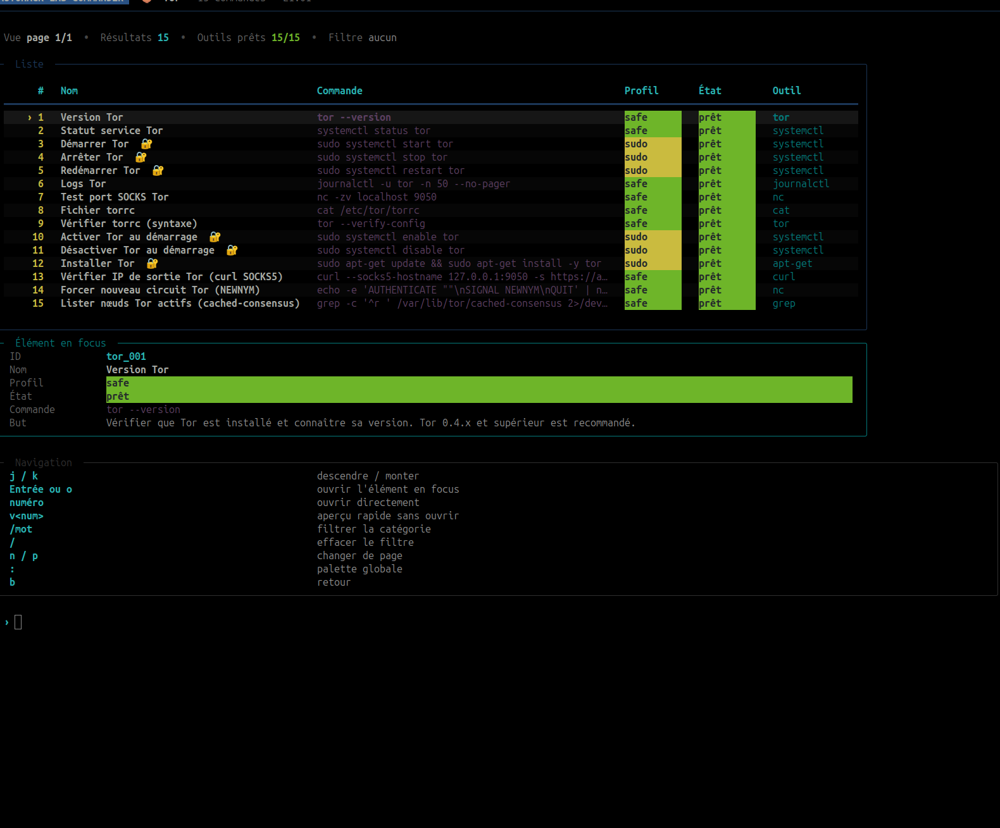
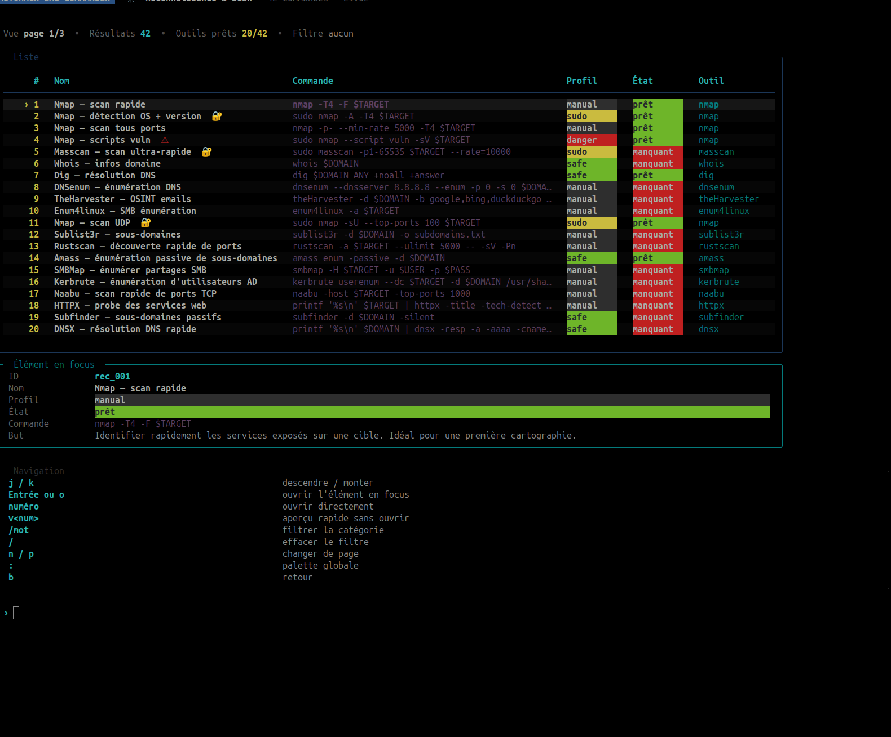

# AUTOHACK LAB COMMANDER


AUTOHACK LAB COMMANDER is a Security Lab Command Organizer. It helps you organize, search, document, and review security lab commands from one place. It is built for students, CTF players, homelab users, and security practitioners who want a structured command catalog instead of scattered notes.

The project provides both an interactive Rich-powered terminal UI and a non-interactive CLI. The catalog currently contains 1,413 commands across 16 categories, including system checks, local network diagnostics, Tor/Privoxy, Scrapy, Elasticsearch, reconnaissance, web testing, password auditing, post-exploitation lab workflows, cloud/Kubernetes, forensics, binary analysis, and XSS payloads.

> Important: this project is intended for legal labs, owned systems, CTFs, training environments, and authorized security assessments only. Many catalog entries can be intrusive or dangerous outside a controlled environment.

## Why I Built This

I wanted a structured terminal tool to centralize security lab commands, reduce note sprawl, and make command usage easier to review before execution.

## What It Does

AUTOHACK helps you:

- browse a large security command catalog by category
- search commands by keyword, tag, command text, or ID
- inspect purpose, prerequisites, risks, expected output, and required tools
- run safe commands from the terminal UI
- dry-run sensitive commands before copying or executing them
- export the catalog as Markdown, TXT, JSON, or HTML
- track local command history and favorites
- check which required tools are installed on your machine

It is not an exploitation framework and it does not hide what commands do. The goal is to make command usage clearer, safer, and easier to review before anything is executed.

## What This Is Not

AUTOHACK is not:

- an autonomous exploitation framework
- a botnet tool
- a stealth malware platform
- a replacement for understanding what commands do

## Safe by Design

The project is designed to keep execution visible and reviewable:

- commands are cataloged with metadata such as category, risk, and tool requirements
- interactive flows show the command before execution
- dry-run and copy-only paths remain available for review
- security-related policies are surfaced in the UI and CLI instead of being hidden
- catalog verification and signing are available when you want stronger integrity checks

These are design choices, not guarantees that replace operator judgment.

## Use Cases

- build and review command sets for a personal lab
- prepare CTF notes and reusable workflows
- keep homelab admin and security checks in one catalog
- document authorized assessment steps before execution
- export command catalogs for reports, runbooks, or internal sharing

## Risk Levels

AUTOHACK exposes the risk level already attached to each catalog entry. In practice:

- `safe` is intended for low-risk, read-only, or informational actions
- `dry_run_only` is meant to be previewed or copied rather than executed directly
- `lab_only` is intended for controlled environments only
- `dangerous` highlights commands that deserve extra review before use

The default behavior remains compatible with the current project. Any stronger profile or stricter local policy is optional.

## Main Features

- Interactive TUI built with `rich`
- CLI mode for automation and quick lookups
- 1,413 catalog entries
- 1,013 XSS payload entries
- Tagged command search with accent-insensitive matching
- Advanced search modes: regex and risk-first sorting
- Safety metadata: `safe`, `dry-run`, `lab-only`, `dangerous`, `sudo`
- Enforced execution policies (`dry_run_only`, `lab_only`)
- Configurable command timeout and strict shell mode
- Secret redaction in logs and exports
- Structured execution telemetry in `logs/executions.jsonl`
- Local RBAC roles: `reader`, `operator`, `admin`
- Read-only security status diagnostic (`admin security-status`)
- Secondary approval queue for sensitive commands
- Catalog signature verification (`commands_catalog.sig`)
- Category-based command allowlist execution policy
- Environment profiles (`lab1`, `lab2`, `ctf`, `client`)
- Session export/replay (`--export-session`, `--replay-session`)
- Plugin catalog merge support via `plugins/catalog/*.json`
- Tool checker cache TTL control and manual refresh
- Execution report export (`--export-exec-report`)
- FR/EN message layer for core security prompts
- Catalog diff tooling across refs/tags (`--catalog-diff`)
- Pack-to-playbook generation (`--generate-playbook`)
- Local read-only API server (`--serve-api`)
- Local usage analytics (`--usage-metrics`)
- Signed audit chain verification (`--verify-audit-chain`)
- Binary packaging script + CI artifact workflow
- Tool availability checks
- Optional dependency installer profiles with dry-run support
- Favorites and session history
- Export support: `md`, `txt`, `json`, `html`
- Shell completion generation for Bash and Zsh
- Test suite covering catalog, CLI, executor, config, exports, and menus
- CI with Ruff linting and coverage reporting

## Categories

| Category | ID | Commands |
|---|---|---:|
| System / Environment | `system` | 32 |
| Local Network | `network` | 18 |
| Tor | `tor` | 15 |
| Privoxy | `privoxy` | 10 |
| Scrapy | `scrapy` | 15 |
| JSON / Export | `json_export` | 10 |
| Elastic / Logs | `elastic` | 13 |
| Diagnostic / Debug | `diagnostic` | 18 |
| Recon & Scan | `recon` | 46 |
| Web Attack | `web_attack` | 61 |
| Password Auditing | `passwords` | 34 |
| Post-Exploitation Lab | `post_exploit` | 81 |
| Cloud / Kubernetes | `cloud` | 18 |
| Forensics / DFIR | `forensics` | 14 |
| Binary / Reverse | `binary` | 15 |
| XSS Payloads | `xss` | 1,013 |

## Installation

Requirements:

- Python 3.10+
- Linux is recommended

Clone the repository and create a virtual environment:

```bash
git clone https://github.com/SonFire03/autohack.git
cd autohack
python3 -m venv .venv
source .venv/bin/activate
python3 -m pip install --upgrade pip
pip install -r requirements.txt
```

Dependencies are intentionally small and split between runtime, tests, and dev extras:

- Runtime and test baseline from `requirements.txt`:
  - `rich` for the terminal UI
  - `pyperclip` for clipboard integration
  - `fastapi` for the local API server
  - `uvicorn` for the local API server runtime
  - `pytest` for tests
- Development extras from `pyproject.toml`:
  - `pytest-cov`
  - `ruff`
  - `pexpect`
  - `pyinstaller`

Some catalog commands require external security tools such as `nmap`, `ffuf`, `hydra`, `hashcat`, `sqlmap`, `tor`, `privoxy`, `nuclei`, and others. AUTOHACK can report missing tools, but it does not install system packages automatically.

Deactivate the virtual environment later:

```bash
deactivate
```

## Quick Start

Launch the interactive interface:

```bash
python3 main.py
```


Search the catalog:

```bash
python3 main.py --search tor
python3 main.py --search "graphql introspection"
python3 main.py --search aws --category cloud
python3 main.py --search xss --dangerous --limit 20
python3 main.py --search certipy --tool certipy
python3 main.py --search "sys_00[1-3]" --regex
python3 main.py --search xss --dangerous --sort-by risk --limit 10
python3 main.py --refresh-tools
```



Show one category:

```bash
python3 main.py --category recon
python3 main.py --category web_attack
```




Show a guided command pack:

```bash
python3 main.py --pack web-recon
python3 main.py --pack ad-lab
python3 main.py --pack cloud-audit
```

Run a guided pack step-by-step:

```bash
python3 main.py --run-pack web-recon
python3 main.py --generate-playbook web-recon
python3 main.py --catalog-diff v0.3.0..v0.4.0
python3 main.py --usage-metrics
python3 main.py --verify-audit-chain
python3 main.py --serve-api
python3 main.py --apply-profile lab1
python3 main.py --list-approvals
python3 main.py --approve-command pex_074
```


Preview a command without executing it:

```bash
python3 main.py --dry-run sys_001
```


Run a command by ID:

```bash
python3 main.py --run sys_001
```


Export the full catalog:

```bash
python3 main.py --export md
python3 main.py --export json
python3 main.py --export html
python3 main.py --export-exec-report
python3 main.py --export-session session.json
python3 main.py --replay-session session.json
```


Run tests:

```bash
python3 -m pytest
```


Run lint and coverage locally:

```bash
pip install -e ".[dev]"
python3 -m ruff check .
python3 -m pytest --cov --cov-report=term-missing
```

Review missing tools or preview dependency installation:

```bash
python3 main.py --missing-tools
python3 main.py --install-profile basic --install-dry-run
python3 main.py --install-profile advanced --install-dry-run
```


The interactive `UTILS` column also includes:

- `Target Workspace` to define the current target, URL, scope, notes, and shared variables.
- `Command Builder` to render common lab commands from `$TARGET`, `$LHOST`, `$LPORT`, `$WORDLIST`, and related variables without executing them automatically.

## CLI Reference

```text
python3 main.py --help
```


Available options:

| Option | Purpose |
|---|---|
| `--run CMD_ID` | Execute a command by catalog ID |
| `--dry-run CMD_ID` | Show a command without executing it |
| `--search KEYWORD` | Search the catalog with multi-word matching |
| `--pack PACK` | Show a guided read-only command pack |
| `--run-pack PACK` | Execute a guided command pack step-by-step |
| `--generate-playbook PACK` | Generate a markdown playbook from a command pack |
| `--catalog-diff REF_A..REF_B` | Compare catalog entries between two git refs/tags |
| `--usage-metrics` | Show local command usage/failure/timing metrics |
| `--verify-audit-chain` | Verify signed execution audit-chain integrity |
| `--serve-api` | Run local read-only API (`127.0.0.1:8765`) |
| `--apply-profile PROFILE` | Apply environment profile (`lab1/lab2/ctf/client`) |
| `--approve-command CMD_ID` | Approve a command queued for secondary approval |
| `--list-approvals` | List commands pending secondary approval |
| `--category CAT` | List commands in a category, or filter `--search` |
| `--safe` | Filter `--search` to safe commands |
| `--dangerous` | Filter `--search` to dangerous commands |
| `--tool TOOL` | Filter `--search` by required tool |
| `--regex` | Interpret `--search` as a regular expression |
| `--sort-by score\|risk` | Sort search results by relevance score or risk level |
| `--limit N` | Limit `--search` results |
| `--export FORMAT` | Export catalog as `md`, `txt`, `json`, or `html` |
| `--export-exec-report` | Export execution telemetry as a searchable HTML report |
| `--export-session FILE` | Export history/variables/loot session data to JSON |
| `--replay-session FILE` | Replay and inspect a previously exported session |
| `--refresh-tools` | Clear tool detection cache and force re-check |
| `--check` | Run safe tool checks |
| `--list-ids` | Print all command IDs |
| `--list-categories` | Print available categories |
| `--stats` | Show catalog statistics |
| `--favorites` | Show saved favorites |
| `--tag TAG` | List commands matching a tag |
| `--missing-tools` | List required tools missing locally |
| `--install-profile PROFILE` | Install missing dependencies for `basic`, `advanced`, or `all` |
| `--install-dry-run` | Preview install commands without running them |
| `--yes` | Confirm installation commands automatically |
| `--generate-completion SHELL` | Generate Bash or Zsh completion |
| `--version` | Print the app version |

Security and integrity options:

- `user_role` in config controls RBAC permissions (`reader`, `operator`, `admin`)
- `require_secondary_approval=true` queues dangerous/lab-only commands until explicit CLI approval
- `enforce_catalog_signature=true` verifies `commands_catalog.json` with `commands_catalog.sig`
- use `AUTOHACK_CATALOG_SECRET` + `python3 scripts/sign_catalog.py` to sign catalog updates
- `enforce_command_allowlist=true` blocks commands that do not match category allowlist patterns
- `python3 scripts/verify_execution_chain.py` verifies hash-chained `logs/executions.jsonl`

Binary packaging:

- build locally: `bash scripts/build_binary.sh`
- CI workflow: `.github/workflows/binary.yml` publishes `dist/autohack` + SHA256 as artifacts

Available command packs:

| Pack | Purpose |
|---|---|
| `web-recon` | Subdomains, HTTP probing, crawling, templates, and web recon |
| `ad-lab` | Active Directory lab workflow for discovery, Kerberos, ADCS, relay, and privesc review |
| `cloud-audit` | Cloud and Kubernetes posture checks |
| `forensics` | DFIR triage for memory, logs, YARA, and timelines |
| `binary-ctf` | Reverse engineering and pwn CTF analysis workflow |

## Legal and Safe Usage

This project is intended only for:

- personal labs
- owned systems
- CTF environments
- training platforms
- explicitly authorized security assessments

Do not use this tool against third-party systems without written authorization.

AUTOHACK does not automate stealth, persistence, or unauthorized exploitation. Its goal is to make security lab commands easier to organize, review, and execute safely.

## Safety Model

Each command contains metadata describing risk and execution behavior.

Common fields:

- `safe_to_run`: whether the command is considered low risk
- `dangerous`: whether the command may be destructive, intrusive, or sensitive
- `requires_sudo`: whether elevated privileges may be required
- `execution_policy`: policy such as `safe`, `normal`, `dry_run_only`, or `lab_only`
- `risks`: human-readable risk explanation
- `prerequisites`: what must be true before using the command

AUTOHACK is designed to slow you down before risky actions. It shows warnings, command previews, prerequisites, and risk notes so each command can be reviewed before use.

Still, you are responsible for where and how commands are executed. Do not run intrusive commands against systems you do not own or do not have permission to test.

Installer profiles only install known tool dependencies. They do not download sensitive Windows binaries such as credential dumping or privilege escalation executables; those remain manual steps and should only be handled in controlled, authorized lab environments.

## Data And Local Files

Runtime data is stored locally. These files are not meant to be committed:

- `logs/` for application logs
- `exports/` for generated catalog exports
- `~/.autohack.json` for user configuration
- `~/.autohack_history.json` for local history
- `~/.autohack_favorites.json` for favorites
- `~/.autohack_variables.json` for target workspace variables

The repository includes `.gitkeep` files so `logs/` and `exports/` exist, but generated content inside them is ignored by Git.

If your local working tree contains old generated files, remove them locally after confirming you do not need them. They are ignored by Git and are not required to run the project.

## Project Structure

```text
autohack/
├── main.py                  # CLI entrypoint and TUI launcher
├── commands_catalog.json    # Command and payload catalog
├── requirements.txt         # Python dependencies
├── pyproject.toml           # Packaging metadata and console script
├── .github/workflows/       # GitHub Actions test workflow
├── catalog/                  # Source catalog split by category
├── config/                  # App settings and category labels
├── core/                    # Catalog, executor, checker, exports, theme, config
├── menus/                   # Rich terminal UI screens
├── scripts/                 # Maintenance scripts
├── tests/                   # Pytest suite
├── docs/examples/           # Example generated report
├── docs/screenshots/         # README screenshots
├── logs/                    # Runtime logs, ignored except .gitkeep
└── exports/                 # Generated exports, ignored except .gitkeep
```

## How The Catalog Works

The source catalog is split by category in `catalog/*.json`. The runtime file `commands_catalog.json` is generated from those files so the application can keep loading one fast, simple JSON document.

Regenerate the merged catalog after editing category files:

```bash
python3 scripts/build_catalog.py
```

Check that the generated file is up to date:

```bash
python3 scripts/build_catalog.py --check
```

Commands are grouped by category and include metadata used by both the TUI and CLI.

Minimal command shape:

```json
{
  "id": "sys_001",
  "name": "Python version",
  "command": "python3 --version",
  "risks": "No risk, read-only",
  "safe_to_run": true
}
```

Common optional fields:

```json
{
  "short_name": "python version",
  "description": "Show installed Python version",
  "purpose": "Verify the runtime before launching tools",
  "expected_output": "Python 3.x.x",
  "prerequisites": [],
  "tool_required": "python3",
  "dangerous": false,
  "requires_sudo": false,
  "tags": ["python", "system"],
  "execution_policy": "safe"
}
```

Search uses IDs, names, tags, descriptions, purpose text, and command text. Multi-word searches use AND logic, so every searched word must match somewhere in the command metadata.

An example generated Markdown report is available at `docs/examples/example_report.md`.

## Shell Completion

Generate completion scripts from the live catalog:

```bash
python3 main.py --generate-completion bash
python3 main.py --generate-completion zsh
```

The generated completion includes command IDs, categories, and CLI flags.

## Versioning

The application version is defined in `config/version.py` and reused by the CLI and packaging metadata. Check the installed version with:

```bash
python3 main.py --version
```

## Development

Run the test suite:

```bash
python3 -m pytest
```

Useful targeted tests:

```bash
python3 -m pytest tests/test_catalog.py
python3 -m pytest tests/test_cli.py
python3 -m pytest tests/test_executor.py
python3 -m pytest tests/test_main_menu.py
```

Before publishing changes, run:

```bash
python3 -m ruff check .
python3 scripts/build_catalog.py --check
python3 -m pytest --cov --cov-report=term-missing
python3 main.py --stats
```

For contribution rules, setup notes, and catalog guidelines, see `CONTRIBUTING.md`.

## Adding Commands

To add a command:

1. Edit the matching file in `catalog/`.
2. Pick a unique ID that matches the category prefix.
3. Fill in `name`, `command`, `risks`, and `safe_to_run`.
4. Add tags and prerequisites when useful.
5. Mark risky commands with `dangerous: true`.
6. Use `dry_run_only` or `lab_only` for commands that should not be executed casually.
7. Regenerate `commands_catalog.json` with `python3 scripts/build_catalog.py`.
8. Run the tests.

For broad catalog additions, add tests in `tests/test_catalog.py` so the coverage cannot disappear silently later.

## Roadmap

- [x] GitHub Actions CI
- [x] Modern packaging metadata with `pyproject.toml`
- [x] Centralized app version
- [x] Ruff linting in CI
- [x] Coverage reporting in CI
- [x] Split `commands_catalog.json` by category and generate the merged catalog
- [ ] Improve HTML export styling
- [ ] Add demo/screenshot mode for repeatable screenshots

## Legal Notice

AUTOHACK contains commands and payloads that can be harmful when misused. The project is provided for education, defensive research, CTFs, and authorized lab work. You are responsible for complying with applicable laws and rules of engagement.

Do not use this project against third-party systems without explicit authorization.
